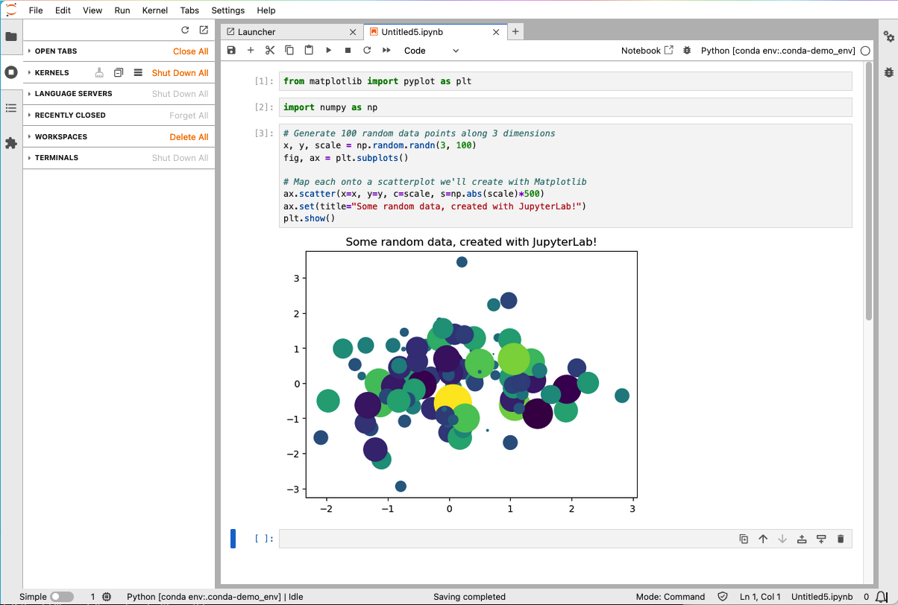

# Open OnDemand Jupyter notebook / Jupyterlab 
<!-- Describe the app from a user's perspective. This is a simplied version of Overview -->
## FASRC users

Jupyter notebook / Jupyterlab is an Open OnDemand app that launches Jupyter notebook or Jupyterlab  as an interactive session on a compute node. 
 
It is designed for researchers who need a web-based interactive development environment for notebooks, code, and data. Its flexible interface allows users to configure and arrange workflows in data science, scientific computing, computational journalism, and machine learning.

<!-- Link any relevant FASRC docs -->
<!-- ### Using [app name] -->

<!-- Link how to create Sandbox -->
### Sandbox app

For how to create a Sandbox app, see the [Developing your own app using Open
OnDemand](https://docs.rc.fas.harvard.edu/kb/developing-apps-on-ood/)
documentation.

## Appverse overview

> [!NOTE]  
> This section is intended for sys-admins, developers, and power users.

Jupyter notebook / Jupyterlab is an Open OnDemand app that launches Jupyter notebook or Jupyterlab as an interactive web server session on  HPC clusters. 
 
It is designed for researchers who need a web-based interactive development environment for notebooks, code, and data. Its flexible interface allows users to configure and arrange workflows in data science, scientific computing, computational journalism, and machine learning.
- Upstream project: [Jupyter](https://jupyter.org/)

This app uses the Batch Connect `basic` template with Slurm.

- **Batch Connect template:** `basic`
- **Scheduler:** Slurm

## Screenshots

<!-- A screenshot helps deployers verify their installation and helps users understand what they'll get. -->
<!-- Place images in a screenshots/ or docs/ directory. -->



## Features

<!-- List the key capabilities specific to THIS OOD app (not the upstream software). -->

- Launches Jupyter via web server on compute nodes
- Supports GPU and CPU execution
- Configurable partition, memory, CPU cores, GPU cards, and wall time via the launch form
- Additional Slurm options pass-through (long format)
- Reservation support and optional Slurm account
- Email notification on job start
- Module-based
- Jupyterlab / Jupyter Notebook toggle

## Requirements

### Compute Node Software

<!-- Batch Connect: What must be installed on the compute nodes where jobs will run? -->
<!-- Passenger: What must be installed on the OOD host? -->

- Centralized, read-only virtual environment (using Python 3.12 in this repo at time of writing)
  -  environment has jupyterlab, notebook and nb_conda_kernels installed in it, e.g.:
```
# python3.12 -mvenv /n/sw/jupyterlab/jupyterlab-4.5.0
# . /n/sw/jupyterlab/jupyterlab-4.5.0
(jupyterlab-4.5.0) # pip install --no-cache-dir jupyterlab==4.5.0 notebook==7.5.0 git+https://github.com/anaconda/nb_conda_kernels@2.5.2
```

The CONDA_EXE environment varible must be set to the path of a conda executable in [template/script.sh.erb](template/script.sh.erb).  
nb_conda_kernels will use the conda executable directly to search for additional kernels installed in the users' conda environments, but otherwise the conda environment containing the conda executable will not be used.

### Open OnDemand

- Open OnDemand v3.0+
- [Slurm](https://slurm.schedmd.com/) job scheduler


## App Installation

Please see the [References section](#software-installation) below for instructions on how to install the software that is launched by this app.

### 1. Clone the repository

```bash
# Batch Connect / Passenger apps:
cd /var/www/ood/apps/sys

git clone https://github.com/fasrc/ood-jupyter.git
cd ood-jupyter

```

### 2. Configure for your site

<!-- Point deployers to the ONE place they need to edit. -->
#### form.yml.erb Attributes

Edit `form.yml.erb` and update these values for your cluster (in order as they
appear at the bottom of [form.yml.erb](form.yml.erb)):

| Attribute | Description | FASRC settings | Change to |
|-----------|-------------|---------| -----------|
| `cluster` | Target cluster ID | `odyssey3` | Your cluster name |
| `bc_queue` | Default scheduler partition | user-defined; default `shared` | Your preferred partition |
| `jupyterlab_switch` | Start Jupterlab instead of Notebook | `1` | Your preference |
| `custom_memory_per_node` | Memory per node (GB) | user-defined; default: `4` | Your preferred memory allocation |
| `custom_num_cores` | Number of cores | user-defined; default `1` | Your preferred default number of cores |
| `custom_num_gpus` | Number of GPUs | user-defined; default `0` | Your preferred default number of GPUs |
| `custom_time` | Maximum wall time (HH:MM:SS) | user-defined; default `04:00:00` | Your preferred default time |
| `working_folder` | **Optional** Override default (homedir) location to launch Jupyter Server in | user-defined | |
| `envscript` | **Optional** Script to run before starting Jupyter |user-defined | |
| `modules` | **Optional** Additional modules to load before starting Jupyter |user-defined | |
| `custom_reservation` | **Optional** Slurm reservation `--reservation` | user-defined | |
| `extra_slurm` | **Optional** Extra slurm option (long-format) | user-defined | Remove if using aother scheduler |
| `bc_account` | **Optional** Alternate slurm account to charge instead of user's primary group | user-defined | Remove if using aother scheduler |
| `custom_email_address` | **Optional** email address for status notificationl used along with `bc_email_on_started` | user-defined | |
| `bc_email_on_started` | **Optional** sends email to `custom_email_address` when job starts | user-defined | |

#### manifest.yml Attributes

Edit `manifest.yml` and update these values for your organization:

| Attribute | Change to |
|-----------|-----------|
| `description` | Your cluster and your documentation |

<!-- Passenger apps: describe any config files, environment setup, or bundle install steps. -->
<!-- If there are additional config files, list them too. -->

<!-- Passenger: -->
<!-- Restart the app from the OOD developer dashboard, or restart the PUN. Visit your OOD dashboard and navigate to [App URL]. -->


<!-- Document ALL site-specific values and where they live. -->
<!-- This is the most important section for deployers at other sites. -->

<!-- Batch Connect apps: document form.yml attributes -->
<!-- Passenger apps: document config files, environment variables, or database setup -->


### 3. Verify

<!-- Batch Connect: -->
No OOD restart is needed (Batch Connect apps are detected automatically). Visit your OOD dashboard and look for **Jupyter** under **Interactive Apps > Web Apps**.


## Troubleshooting

### Job starts but app doesn't appear (Batch Connect)

1. Check the job's `output.log` in `~/.ondemand/data/sys/YOUR-APP/`
2. Verify the module loads correctly: `module load software/1.0`

### "Module not found" error

The module name in `form.yml` doesn't match your system. Run `module spider software` to find the correct name and update the `modules` attribute.

### Connection timeout

The app may need more time to start. Increase the connection timeout or check that the compute node can open the required port.

<!-- Add real issues you've encountered during testing. -->

### Jupyter notebook VDI session is terminated right after it starts
This problem is common when there is a `conda initialize` section in the user's .bashrc file located in their home directory. The `conda initialize` section was added when, at some point, the user ran the command `conda init`. Instead of using conda init, we recommend `source activate environment_name`.  

To solve this problem, delete or comment out the `conda initialize` section of your .bashrc and create a new Jupyter notebook VDI session.

### Jupyter notebook/JupyterLab VDI session starts but does not display a ‘Connect to Jupyter’ button
If this problem occurs, you may see an error, jupyter: command not found, in the session's `output.log`.  
To solve this problem, delete the line auto_activate_base: false in the file `~/.condarc`.
## Testing

<!-- Where has this app been deployed and verified? -->

| Site | Operating System* | OOD Version | Scheduler | Status |
|------|------------------|-------------|-----------|--------|
| FASRC | Rocky 8.10 | 3.1 | Slurm 25.11 | Tested |
| FASRC | Rocky 8.10 | 4.0 | Slurm 25.11 | Tested |
| FASRC | Rocky 8.10 | 4.1 | Slurm 25.11 | Tested |

> [!NOTE]
> \*Operating system of compute nodes

<!-- How can a deployer verify it works? -->

To verify your installation:

1. Launch the app from the OOD dashboard with default settings
2. Confirm the application loads in the browser

## Known Limitations

<!-- Be honest about what doesn't work or hasn't been tested. -->

- Multi-node jobs are not supported
- Only tested on RHEL 8; may not work on other distributions

## Contributing

Contributions are welcome. To contribute:

1. Fork this repository
2. Create a feature branch (`git checkout -b feature/my-improvement`)
3. Submit a pull request with a description of your changes

For bugs or feature requests, [open an issue](https://github.com/fasrc/ood-jupyter/issues).

This app is part of the [OOD Appverse](https://ondemand.connectci.org/affinity-groups/ood-appverse). Join the [Appverse Affinity Group](https://ondemand.connectci.org/affinity-groups/ood-appverse) to connect with other contributors.

## References

<!-- Credit upstream projects and any code you borrowed. -->

- [Jupyter](https://jupyter.org/)— the application launched by this OOD app
- [Open OnDemand](https://openondemand.org/) — the HPC portal framework

### Software Installation

* [Jupyter Installation Guide](https://jupyter.org/install)

## License

[MIT License](LICENSE.txt)

## Acknowledgments

This work is supported by [FASRC](https://www.rc.fas.harvard.edu) at Harvard
Univesity.
